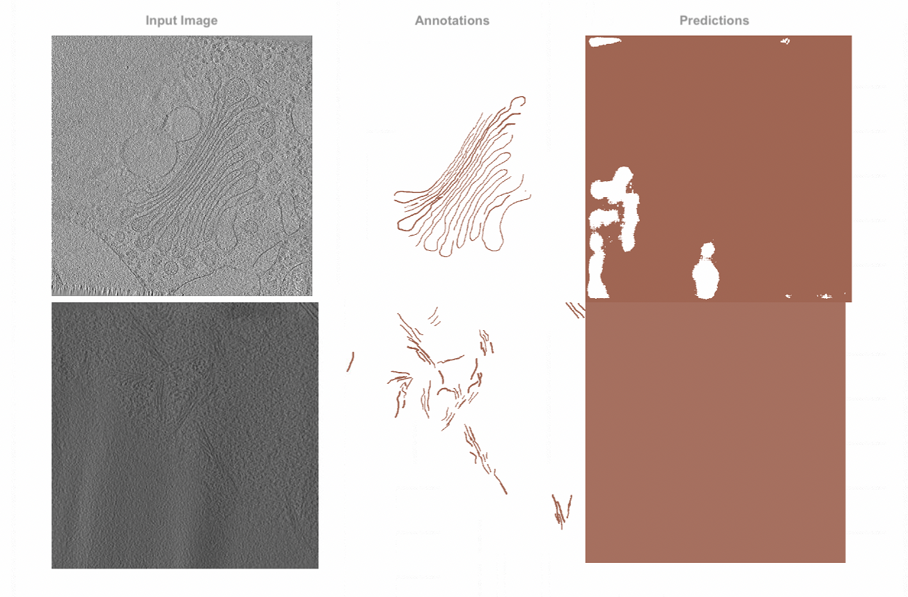
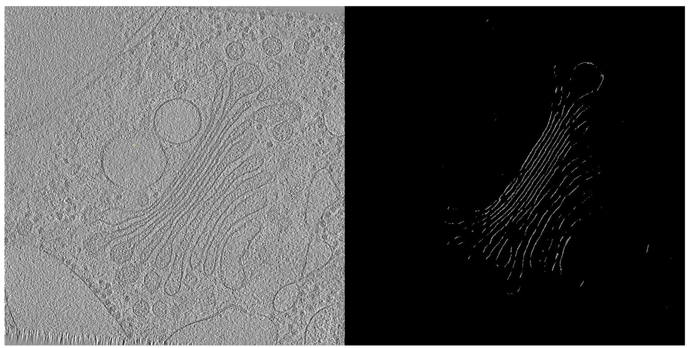

# Cryo Segmentation 

## Challenges

#### Segmentation output with FIBSEM workflow

The outcome of the segmentation for the two sets of cryodata is depicted in the image up top. The samples' 60 images were annotated, and UNET was trained using the same FIBSEM parameters. The prediction demonstrates that the features and background are comparable and projected to be the same entity.
We could also conclude that extra actions are needed to strengthen the prediction, including cryoimage preprocessing.

### Current Research 

The following steps are added to the segmentation workflow for the cryo. 

* To minimize the noise in the image, pre-processing is necessary. The visual noise prevents the network from distinguishing between background/noise and interesting features. This should be decreased to improve the prediction. The background noise should also be reduced using the noise reduction algorithm, which shouldn't affect the edges or features. This can be achieved using the bilateral filter. 
* Using the qlty library created by LBNL, UC Berkeley, the input images are divided into images of size (128,128).  Training the network on smaller images improves performance because the required features only comprise a small portion of the overall image. Before training, the input images and the annotated images were divided into smaller images, which were then stitched back together at their original size.

[3d visualization of segmented ouput](https://github.com/nirajmg/FIBSEM_segmentation/blob/main/cryo/images/3dvisualization_golgi.png)

